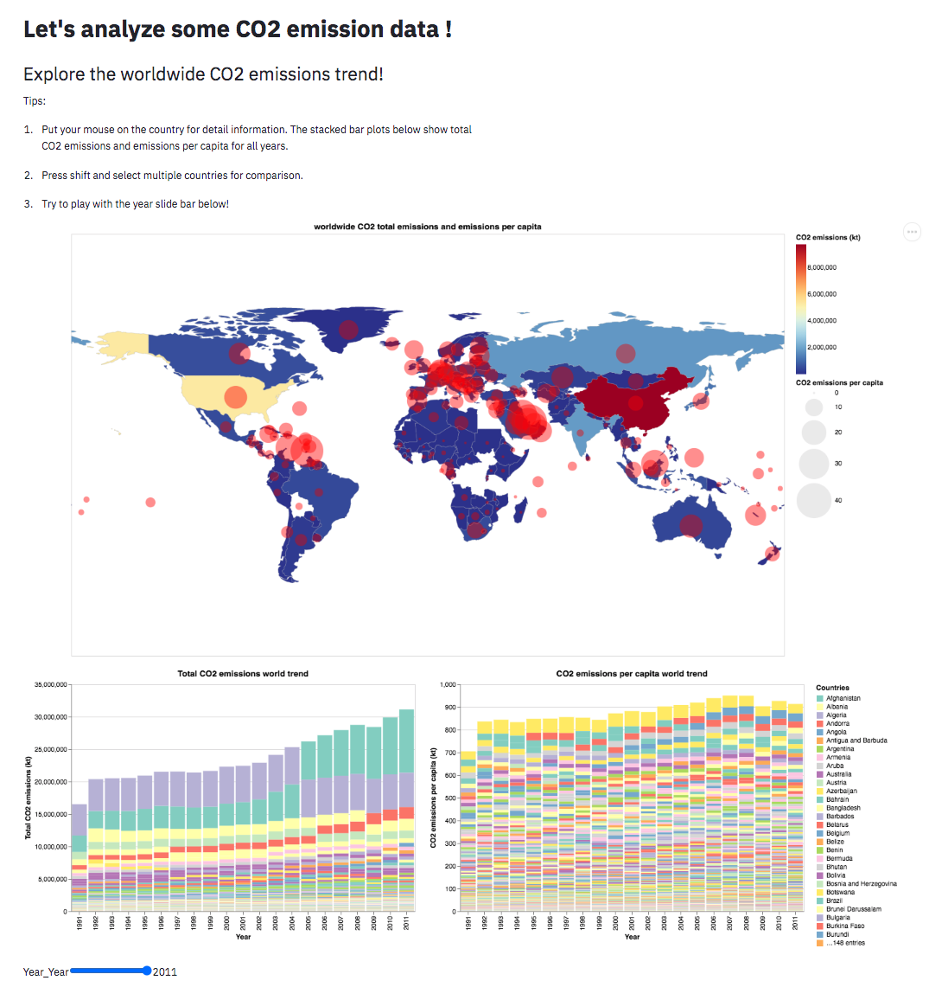

# Explore Worldwide CO2 Emissions

## Project Goals
The goal of our project is to enable the users to explore the worldwide trend of carbon dioxide emissions from 1990 to 2011 and identify sources of CO2 emission and possible factors that may cause some countries to have specific trends. By comparing different countries' total CO2 emissions and emissions per capita, the users are expected to identify the countries that contribute the most to CO2 emissions.
Moreover, by breaking down each country's CO2 emission sources and providing correlations between relevant indicators, the users may discover possible reasons behind certain trends. 

## Design

Since the first part of our project aims to provide a global view of the total CO2 emissions, we chose to use a world map with color and size encodings with a year slide bar. This could give the users a clear overview of the worldwide CO2 total emissions and emissions per capita overtime. We highlight the country and add a tooltip about specific CO2 emission data when users mouse over that country. Moreover, by adding stacked bar charts connected to the world map, the users can select multiple countries from the map they're especially interested in and compare their CO2 emissions throughout the two decades.

The second part aims to guide the users to explore certain countries' CO2 trends and CO2 emissions sources (from liquid, gas, or solid fuel?). Therefore, we designed a scatter plot with color and size encodings to show each country's CO2 emissions overtime. The users can select as many countries as they're interested in from the multiple selection bar, and then the countries will be added to the plot automatically. A bar chart showing the percentage of each CO2 emissions sources is connected to the scatter plot. By enabling interval selection on years on the scatter plot, the users can see the change of each country's CO2 emissions sources overtime. 

The third part of our project aims to let users explore the relationship between CO2 emissions and 8 factors that could potentially affect CO2 emissions overtime. So we decided to use several maps with color encoding and a year slider. Users can select as many factors as they are interested in from the multiple selection bar, and the corresponding maps will be shown automatically. Furthermore, we also used a scatter matrix to display scatter plots for all combinations of chosen factors, which enable users to explore the relationship between factors by themselves. After exploration, the users will be able to answer questions such as "Will more forest areas in a country cause that country to have low CO2 emissions?" or "What factors cause certain countries to have higher CO2 emissions than others?"

## Development

Our project has three sections, each of us is responsible for one section and then collaborates on the last section. Each of us spent about 30 hours on this project, including topic brainstorming, project design, visualization design, plot development and weekly meetups. The aspects that took the most time are choosing the appropriate types of plots according to our goal and building interactive world map. The actual visualization implementation part cost the most time since we need to explore different functionalities of Altair in order to achieve our design. Moreover, the original data from world bank isn't sufficient to build an interactive world map, therefore we searched for trustable datasets on coordinates of each country and combine all the datasets with the built-in map in vega datasets.  
